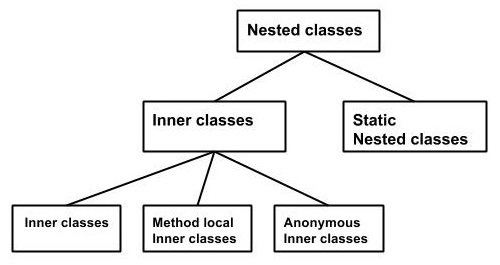

# 1. Classes, static classes, inner classes #
* `*.java` file must have **exactly one public class**, its name must be equal to filename

## Inner classes ##
* see: [www.tutorialspoint.com/java/java_innerclasses](https://www.tutorialspoint.com/java/java_innerclasses.htm)
  * in Java can't exist class with `private` modifier - **except inner class**

### Inner class ###
* to creation new instance of inner class must exist instance of outer class
* has access to attributes and methods of outer class
* it can exist inner class inside method - its instance is available only inside the method

### Anonymous Inner class ###
* declaration and instance creation is at the one place (in single command) - class definition 
is at the another place as abstract class or interface
* has no access to attributes and methods of abstract class
* can be used as method input argument - abstract method must be implemented at the usage place
* since Java 8 is possible to use lambda expressions or method reference (see next chapters of OCA and OCP parts)

### Nested Static class ###
* is accessible without instance of outer class
* has no access to attributes and methods of outer class