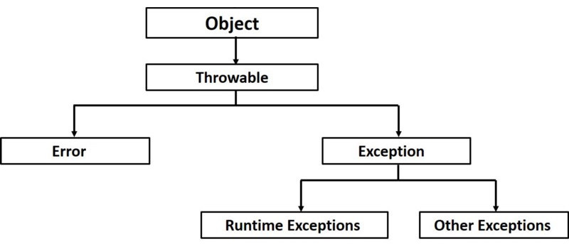

# 13. Exceptions #
* [www.tutorialspoint.com/java/java_exceptions](https://www.tutorialspoint.com/java/java_exceptions.htm)
* order of `catch` blocks must be from more to less specific - in other case occurs compilation error
* if the `return` statement is in `try` and at the same time in `finally` block, 
the value from `finally` is returned (value from `try` block is ignored)
* if in code is only `try-finally` (without any `catch` block) and finally block contains `return` statement, 
the possibly exception thrown in try is ignored

## Error ##
* mostly is error that is not in control of user or programmer
* e.g.: `OutOfMemoryError`, `StackOverflowError`, `AssertionError`, `ReflectionError`, ...

## Runtime exceptions ##
* **=unchecked exception**
* this exceptions are ignored at compile time
* it should be logic errors or errors caused by wrong usage of API
* e.g.: `NullPointerException`, `ClassCastException`, `IndexOutOfBoundException`, ...

## Other exceptions ##
* **=checked exception**
* exceptions that are checked at compile time - it can occurs compilation error
* can't be easily ignored (e.g. as unchecked exceptions), as solution can be:
  * catch it and handle with `try-catch`
  * propagate with `throws *Exception` to processing in next method usage
* e.g.:  `IOException`, `SqlException`, `JAXBException`, `ParseException`, ...